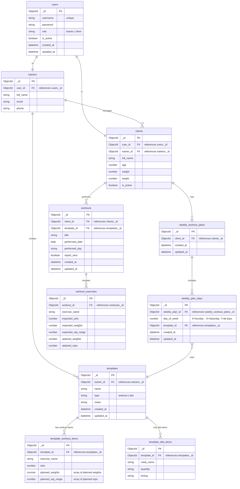

## ER Diagram:

```mermaid
%% Well-structured and lowercase ER diagram for MkDocs rendering
erDiagram

    users {
        ObjectId _id PK
        string username "unique"
        string password
        string role "trainer | client"
        boolean is_active
        datetime created_at
        datetime updated_at
    }

    trainers {
        ObjectId _id PK
        ObjectId user_id FK "references users._id"
        string full_name
        string email
        string phone
    }

    clients {
        ObjectId _id PK
        ObjectId user_id FK "references users._id"
        ObjectId trainer_id FK "references trainers._id"
        string full_name
        number age
        number weight
        number height
        boolean is_active
    }

    weekly_workout_plans {
        ObjectId _id PK
        ObjectId client_id FK "references clients._id"
        datetime created_at
        datetime updated_at
    }

    weekly_plan_days {
        ObjectId _id PK
        ObjectId weekly_plan_id FK "references weekly_workout_plans._id"
        number day_of_week "0=Sunday .. 6=Saturday. 7=all days"
        ObjectId template_id FK "references templates._id"
        datetime created_at
        datetime updated_at
    }

    templates {
        ObjectId _id PK
        ObjectId trainer_id FK "references trainers._id"
        string name
        string type "workout | diet"
        string notes
        datetime created_at
        datetime updated_at
    }

    template_workout_items {
        ObjectId _id PK
        ObjectId template_id FK "references templates._id"
        string exercise_name
        number sets
        numner planned_weights "array of planned weights"
        number planned_rep_range "array of planned reps"
    }

    template_diet_items {
        ObjectId _id PK
        ObjectId template_id FK "references templates._id"
        string meal_name
        string quantity
        string timing
    }

    workouts {
        ObjectId _id PK
        ObjectId client_id FK "references clients._id"
        ObjectId template_id FK "references templates._id"
        string title
        date performed_date
        string performed_day
        boolean report_sent
        datetime created_at
        datetime updated_at
    }

    workout_exercises {
        ObjectId _id PK
        ObjectId workout_id FK "references workouts._id"
        string exercise_name
        number expected_sets
        number expected_weights
        number expected_rep_range
        number attained_weights
        number attained_reps
    }

    %% Relationships
    users ||--|| trainers : "is"
    users ||--|| clients : "is"
    trainers ||--o{ clients : "manages"
    trainers ||--o{ templates : "creates"
    clients ||--o{ weekly_workout_plans : "has"
    weekly_workout_plans ||--o{ weekly_plan_days : "includes"
    weekly_plan_days }o--|| templates : "uses"
    clients ||--o{ workouts : "performs"
    workouts ||--o{ workout_exercises : "includes"
    templates ||--o{ template_workout_items : "has workout items"
    templates ||--o{ template_diet_items : "has diet items"
```
